## 3.1.1 About MakeCode(must-read)

⚠️ **The following steps are operated on the Windows operating system. If you use another operating system, you can take them as a reference. Here are demonstrated on Google Chrome / Microsoft Edge.**

**MakeCode Programming Environment:**

Open the [online version of MakeCode editor](https://makecode.microbit.org/#editor).

MakeCode main interface:

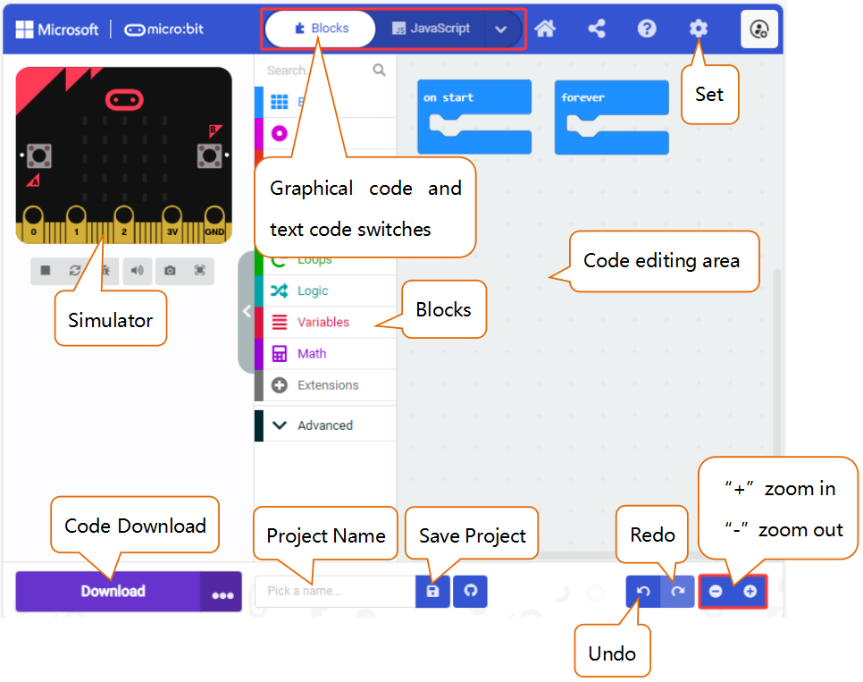

There are blocks “**on start**” and “**forever**” in the code editing area. When the power is plugged or reset, “on start” means that the code in the block only executes once, while “forever” implies that the code runs cyclically.

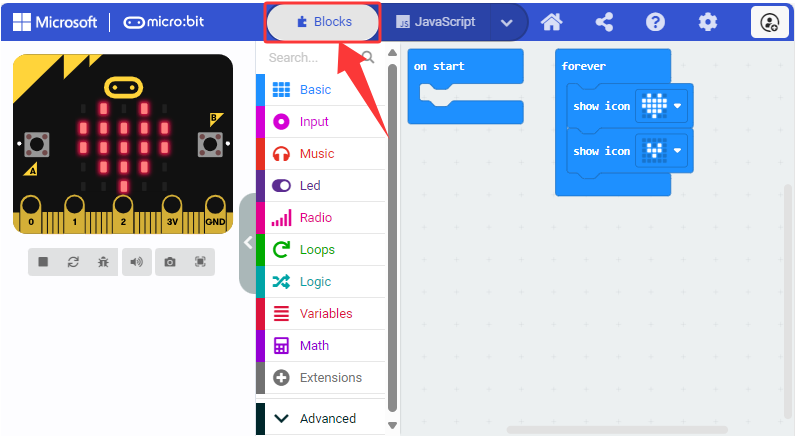

Click  “**JS JavaScript**” to see the JavaScript code:

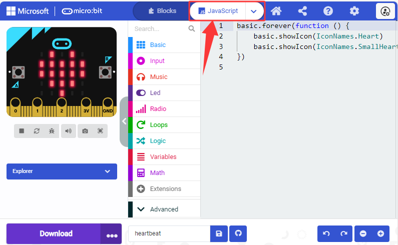

Or click “**Python**” to switch to Python code:

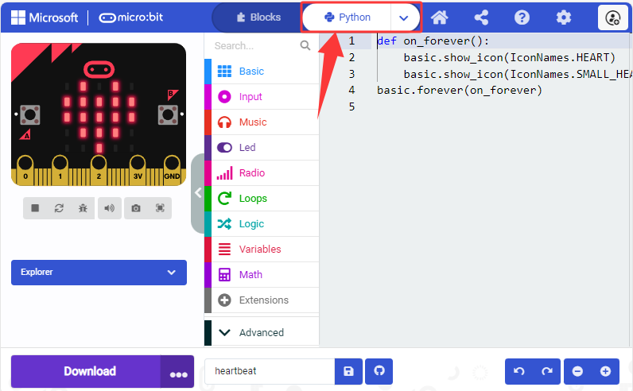

**Language settings:**

## 3.1.2 Makecode Extension Library (Important)

### 3.1.2.1 Add Library

⚠️ **We provide code files (.hex) for each projects, so you can directly load them to the MakeCode editor. Or if you want, you can also build code blocks by yourself. Note that libraries are required when build them manually.**

[MakeCode online version](https://makecode.microbit.org/#editor)

⚠️ **Note:** Copy and paste the link into the search box: `https://github.com/keyestudio2019/pxt-creative-inventors-kit-master.git`.

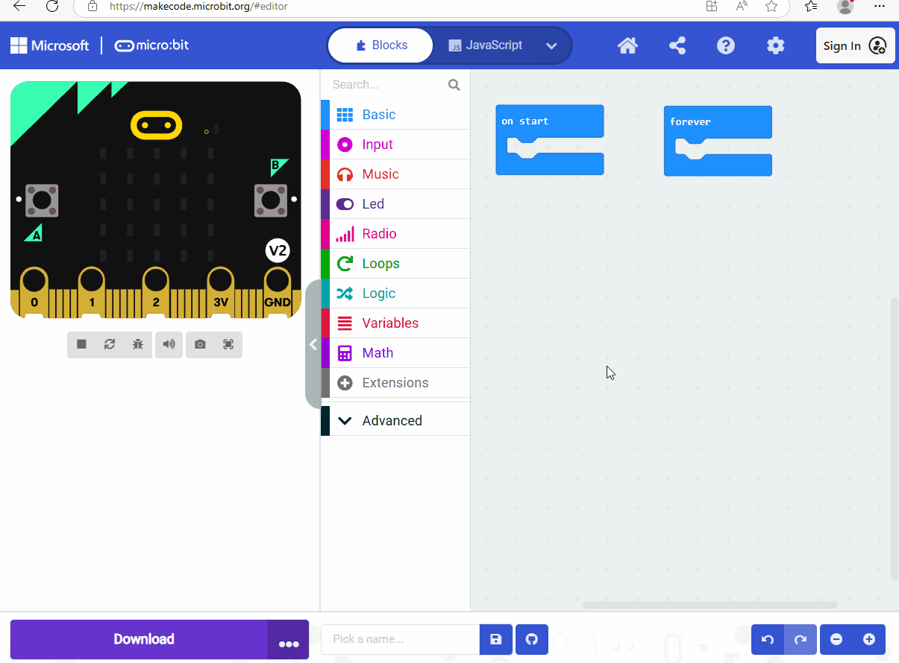

### 3.1.2.2 Update/Delete Library

⚠️ **Generally, there is no need to remove libraries, unless they are not required.**

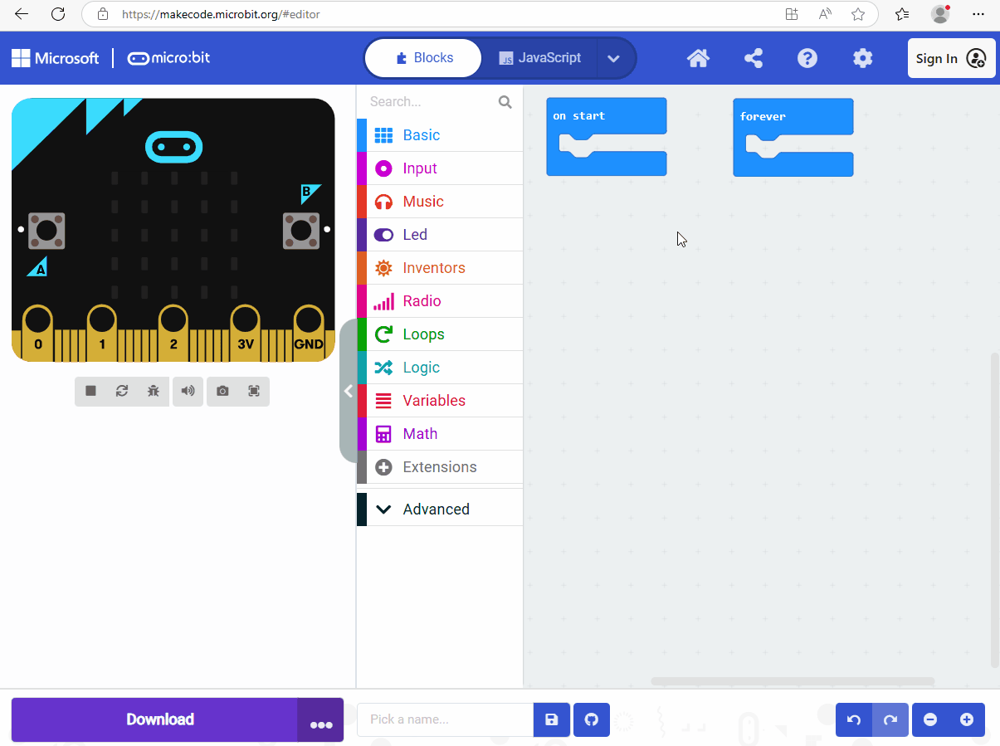

## 3.1.3 MakeCode Program

### 3.1.3.1 Import Program in MakeCode

1\. Download the example code [heartbeat](./heartbeat.7z).

2\. Connect the micro:bit V2 board to your computer via micro USB cable.

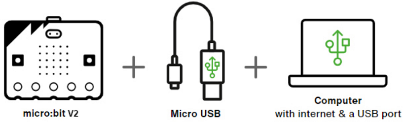

On the micro:bit V2 board, there is a yellow LED indicator that will flash when the board communicates with your computer through micro USB. 

Open Finder(Mac) / Devices and drives(Windows), and you can see a USB drive named "MICROBIT". Yet note that it is not a common disk!

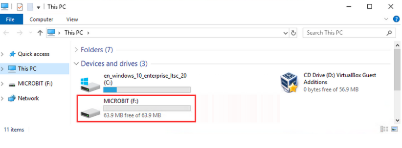

3\. There are two ways to import/update the stored code file(**.hex**) in [MakeCode](https://makecode.microbit.org). We will take the file “**heartbeat**” as an example.

**Method 1:** Just click "import":

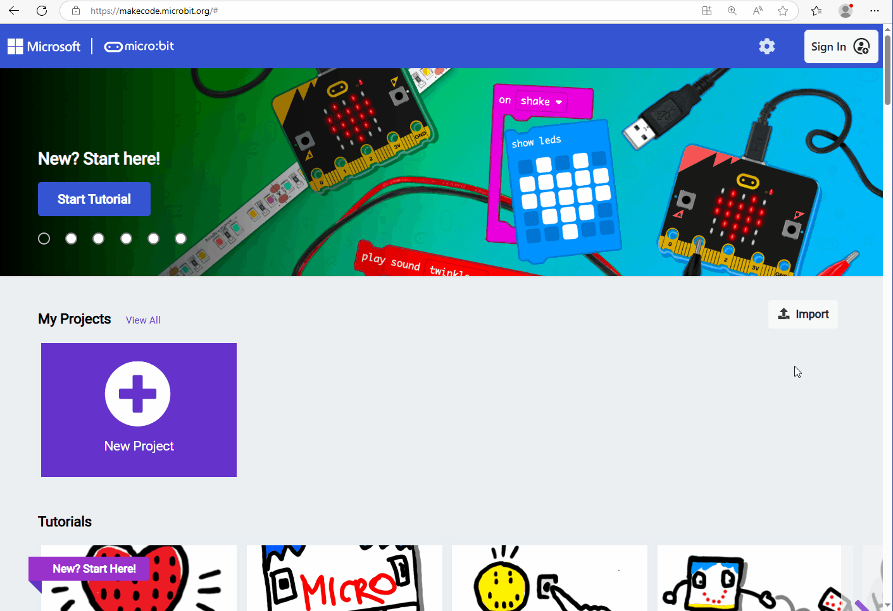

**Method 2:** Drag the hex file to the Makecode main interface:

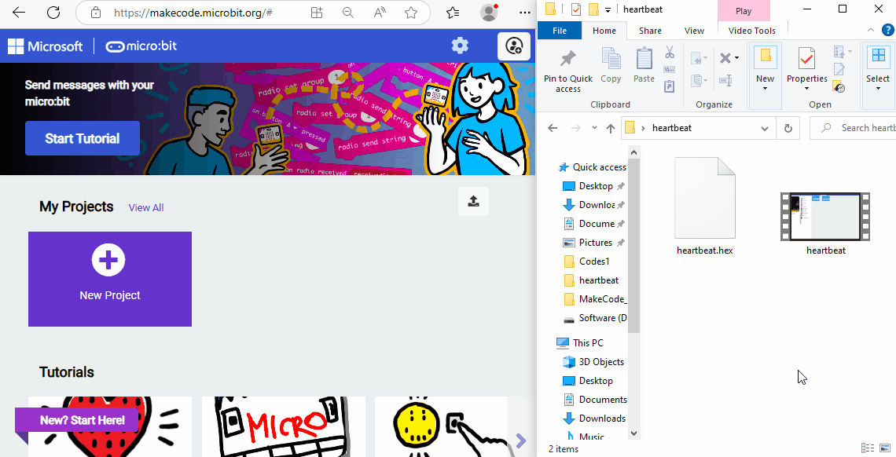

Note: The micro:bit board runs only one program at a time. Each time you download and send another file to the device via the micro USB cable, it will erase the current one and replace it with a new one.

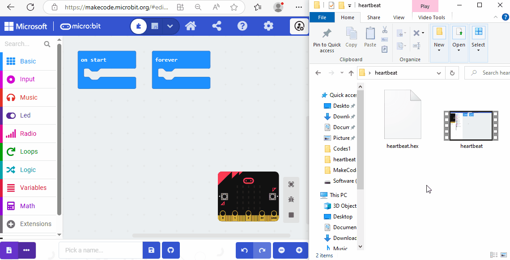

### 3.1.3.2 Download Code (WebUSB)

For browsers like **Google Chrome/Microsoft Edge**, their WebUSB allows direct access to the micro USB hardware device through online web page. Click “Connect Device” to pair the device. After that, click “**Download**” to load the code to the micro:bit V2 board.

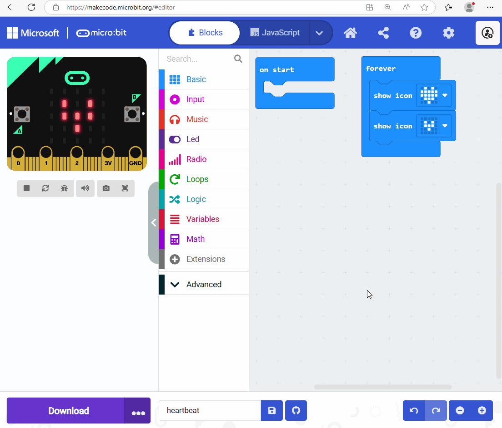

⚠️ **Tips**

If there is no device for pairing in the interface, please see the [device-webusb-troubleshoot](https://makecode.microbit.org/device/usb/webusb/troubleshoot).

If the micro:bit firmware requires an update, please see [how-to-update-the-firmware](https://microbit.org/guide/firmware/).

### 3.1.3.3 Download Code (none WebUSB)

For browsers like **Safari/Firefox/and so on**, please load the code to the micro:bit V2 board as follows:

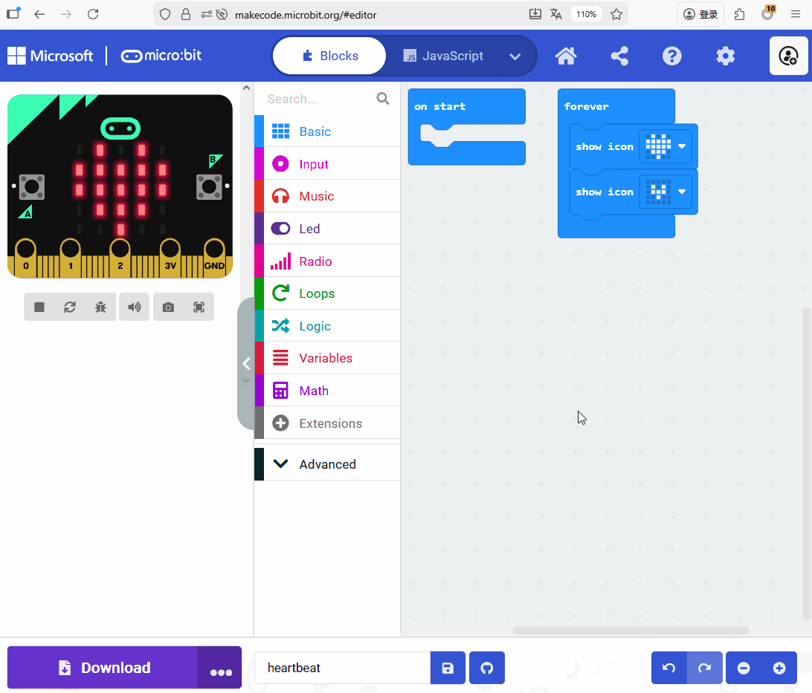

### 3.1.3.4 Download Code (Downloaded HEX Program)

Find the downloaded **.hex** file and drag it to the MICROBIT drive.

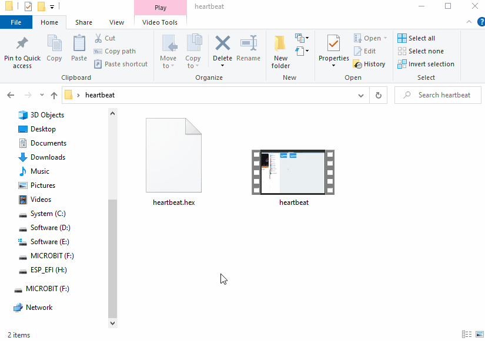

Or you can choose “Send to -> MICROBIT”.

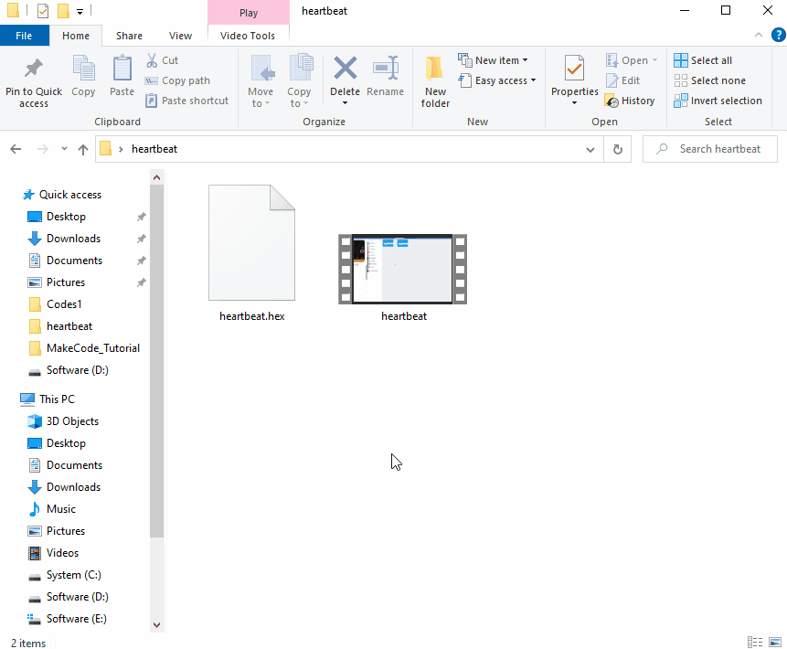

After that, connect the micro: bit V2 board to the computer via micro USB cable and power on, and you can see the on-board 5 x 5 LED matrix repeatedly shows  and  .

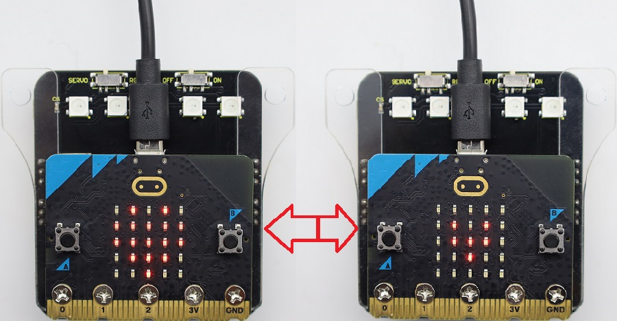

⚠️ **Tip 1:** There is also a get-stared guide for [how to transfer code to the microbit from multiple device](https://microbit.org/get-started/user-guide/transfer-code-to-the-microbit).

⚠️ **Tip 2:** During each programing, the MICROBIT disk will automatically eject and return, and the **.hex** files you have copied to it will not be displayed. That is because the micro:bit V2 board only receives and runs the latest uploaded program rather than stores them.
