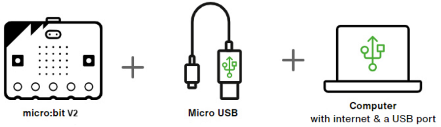
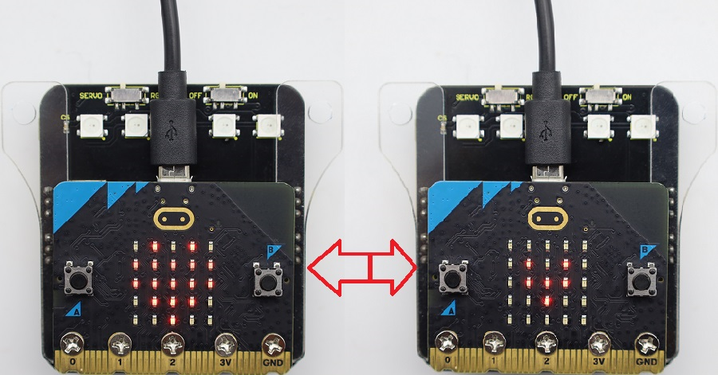

## 3.1.1 MakeCode介绍(必读)

⚠️ **特别提醒：以下的步骤说明是基于Windows操作系统，如果你使用其他的操作系统，可以将其作为参考。同时，以下案例是在 Google Chrome 或 Microsoft Edge 浏览器 中演示的。**

**MakeCode编程环境：**

打开MakeCode在线网页版本: [MakeCode](https://makecode.microbit.org/#editor)

MakeCode 编译器如下:

在代码编辑区中，有两个固定的代码块 “**on start**” 和 “**forever**”。 **上电或复位后，“on start”代码块中的代码将仅执行一次；并且“forever”代码块中的代码将循环执行。**

点击 “**JS JavaScript**”，你可以看到对应的JavaScript语言代码程序，如下图：

你还可以点击下拉按钮选择 “**Python**”，可以看到对应的Python语言代码程序，如下图：

**界面语言的切换：**

## 3.1.2 MakeCode扩展库(重要)

### 3.1.2.1 添加MakeCode扩展库

⚠️ **特别提醒：我们为每个项目实验提供十六进制代码文件（.hex）。十六进制代码文件包含运行项目所需的所有内容，你可以直接将其导入MakeCode编辑器中使用，也可以手动拖动代码块来创建每个项目实验的代码。如果选择通过手动拖动代码块来创建项目代码，则需要添加库文件。**

打开MakeCode在线网页版本: [MakeCode](https://makecode.microbit.org/#editor)

⚠️ **特别提醒:** 将链接：`https://github.com/keyestudio2019/pxt-creative-inventors-kit-master.git` 复制粘贴到页面的搜索框中。

### 3.1.2.2 更新或删除扩展库

⚠️ **特别提醒：一般情况下，添加好库文件是不需要再删除它们的，除非是不需要它们。这部分内容仅供学习怎样来删除不需要的库文件。**

## 3.1.3 MakeCode示例代码下载

### 3.1.3.1 在MakeCode中导入示例代码

1\. 单击下载示例代码：[heartbeat](./heartbeat.7z)

2\. 用micro USB线连接电脑和micro:bit V2主板。

在micro:bit V2主板上，当你的电脑通过micro USB与micro:bit V2主板通信时，黄色LED指示灯会闪烁。如果micro:bit V2主板连接到电脑时，打开 Finder(Mac) / 文件资源管理器(Windows)，你会注意到 micro:bit 被列为一个名为 ' MICROBIT ' 的USB驱动器。但请注意，它不是普通的USB磁盘！！

3\. 有两种方法可以在MakeCode编辑器：[MakeCode](https://makecode.microbit.org) 中导入或更新已保存的十六进制文件（**.hex**）。接下来，我们以 “**heatbeat**” 示例代码为例。

**方法1：** 点击主页右侧的 “导入” 按钮。

**方法2：** 将十六进制文件（**.hex**）从计算机拖到主页或编辑窗口。

注意： micro:bit 主板一次只能运行一个程序，每次您通过micro USB数据线下载发送十六进制文件到设备上时，它都会擦除当前程序并用新程序替换它。

### 3.1.3.2 下载示例代码(WebUSB功能)

如果是使用 **Google Chrome/Microsoft Edge** 等浏览器的WebUSB功能，该功能允许你直接通过在线网页访问你的micro USB硬件设备。点击 “Connect Device” 按钮来连接设备，连接设备成功后，可以通过单击 “**Download**” 按钮将示例代码快速下载到micro:bit V2主板。

⚠️ **特别提醒：**

如果弹出窗口中没有设备，请参考以下链接中的内容进行故障排查：

[https://makecode.microbit.org/device/usb/webusb/troubleshoot](https://makecode.microbit.org/device/usb/webusb/troubleshoot)

如果你的micro:bit V2主板需要更新micro:bit的固件，请参考以下链接中的内容：

[https://microbit.org/guide/firmware/](https://microbit.org/guide/firmware/)

### 3.1.3.3 下载示例代码(非WebUSB功能)

如果是使用 **Safari/Firefox/其他** 等浏览器导入示例代码，请按照以下步骤将示例代码上传到micro:bit V2主板上：

### 3.1.3.4 下载示例代码(传输已下载为十六进制文件的程序)

找到已下载的程序 **heartbeat.hex** 文件（例如，在你的本地下载文件夹中），然后将其拖放到 ' MICROBIT ' 驱动器上。

或者，你可以鼠标右键点击 **heartbeat.hex** 文件并选择 “发送到 -> MICROBIT”。

通过上述任意一种方法将示例代码程序上传micro: bit V2主板后，通过micro USB线连接到电脑上给micro: bit V2主板供电，可以看到micro: bit V2主板上的 5 x 5 LED点阵屏先显示图案，再显示图案。循环进行！

⚠️ **特别提醒：** 官方也提供了如何将程序(十六进制 **.hex** 文件)从多个设备传输到micro:bit V2主板的详细教程。

[https://microbit.org/get-started/user-guide/transfer-code-to-the-microbit](https://microbit.org/get-started/user-guide/transfer-code-to-the-microbit)

⚠️ **特别注意：** 每次编程时，MICROBIT磁盘都会自动弹出并返回，但是你已经拷贝到MICROBIT磁盘的十六进制（**.hex**）文件将不会被显示。micro:bit V2主板只能接收并运行最新上传的十六进制（**.hex**）文件，不会存储任何其他文件！

