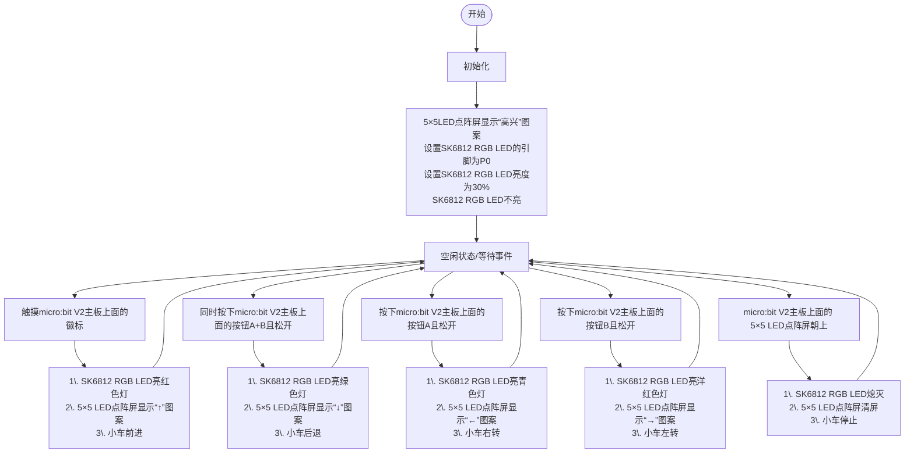

### 3.2.1 多功能小车 

#### 3.2.1.1 简介

使用一些乐高积木件、Microbit V2主板，舵机扩展板、两个乐高舵机和两个车轮子等，来搭建一辆多功能小车，通过Microbit V2主板上面的徽标、按钮A/B与5×5LED点阵屏和代码编程来控制多功能小车实现多功能运行。

#### 3.2.1.2 元件知识

**按钮**

按钮是可以控制电路的通断，把按钮接入电路中，不按下按钮时电路是断开的，按下按钮时电路是导通的。micro:bit主板上有三个按钮，反面有一个复位按钮，正面有两个可编程按钮（按钮A与按钮B）。

**Microbit 5×5LED点阵屏**

micro:bit V2主板的5×5LED点阵屏共由25个发光二极管组成，即可以通过设置坐标点来实现对5×5LED点阵屏中某一个LED的控制。也可以轻松地实现5×5点阵屏显示文字、图案、动画（支持滚动效果），是最直观的输出设备。

**360°乐高舵机**

左右两侧多个拼接孔，正反两面双输出十字轴孔，兼容积木2KG，360°正反快速连续旋转，齿轮减速比为1:140。在超出极限扭矩和随手乱扭的情况下通过跳齿来保护齿轮，该舵机是连续旋转舵机，可以用PWM控制旋转速度和旋转方向，不可以定位角度和圈数。

**参数：**

- 工作电压：3V~6V
- 脉宽设置：500~2500μsec
- 工作角度：360°连续旋转
- 空载电流：65±20mA(3V测试)，80±20mA(5V测试)
- 空载速度：90±10r/min(3V测试)，160±10r/min(5V测试)
- 马达转速：12500±10%(3V测试)，22000±10%(5V测试)
- 停止电流：0.70±0.2A(3V测试)，1.1±0.2A(5V测试)
- 停止扭力：0.5±0.1kg-cm(3V测试)，0.7±0.1kg-cm(5V测试)
- 接线方式：橙色信号S，红色正极+(V/VCC)，棕色负极-(G/GND)

**SK6812 RGB LED**

舵机扩展板上有5个SK6812 RGB LED，SK6812 RGB LED可以发出多种颜色光，通过混合 红、绿、蓝 三种基本颜色光的不同强度，来产生各种丰富的颜色光，颜色光的亮度是可以调节的。

#### 3.2.1.3 所需组件

#### 3.2.1.4 积木搭建

| 左边乐高舵机 | 舵机扩展板引脚(SERVO2/P2) | micro:bit V2主板引脚 |
| :---------: | :----------------------: | :--------------: |
|     棕线    |           GND            |         G        |
|     红线    |           VCC            |         V        |
|    橙黄线   |          SIG(S)          |         P2       |

| 右边乐高舵机 | 舵机扩展板引脚(SERVO1/P1) | micro:bit V2主板引脚 |
| :---------: | :----------------------: | :--------------: |
|     棕线    |           GND            |         G        |
|     红线    |           VCC            |         V        |
|    橙黄线   |          SIG(S)          |         P1       |

#### 3.2.1.5 代码流程图

#### 3.2.1.6 指令方块说明

1\. “on start”代码块中的代码将仅执行一次。

2\. 设置micro:bit V2主板上面的5×5 LED点阵屏显示图案.

3\. 设置SK6812 RGB LED的引脚和点亮RGB LED颗粒数.

4\. 设置SK6812 RGB LED 的亮度.

5\. 设置SK6812 RGB LED 都不亮。

6\. 触摸到micro:bit V2主板上面的徽标时，触发并执行代码块中的一系列动作。

7\. 当按下（或同时按下）micro:bit V2主板上面的按钮（A、B 或A+B）并再次松开时，触发并执行代码块中的一系列动作。

8\. 当micro:bit V2主板上面的5×5 LED点阵屏朝上时，触发并执行代码块中的一系列动作。

9\. 在micro:bit V2主板上面的5×5 LED点阵屏上绘制方向箭头图案。

10\. 设置SK6812 RGB LED点亮的颜色灯.

11\. 设置360°舵机的引脚，转动方向(顺时针/逆时针)和转动的速度(0~100%)。

12\. micro:bit V2主板上面的5×5 LED点阵屏清屏

#### 3.2.1.7 实验代码

⚠️ **特别提醒：可以通过以下两种方法获取示例代码。**

##### **方法一：拖动代码块编写代码**

**1. MakeCode编程环境：**

打开MakeCode编辑器在线网页版本: [https://makecode.microbit.org/#editor](https://makecode.microbit.org/#editor)

**2. 添加专属扩展库**

⚠️ **特别提醒:** 将链接：`https://github.com/keyestudio2019/pxt-creative-inventors-kit-master.git` 复制粘贴到页面的搜索框中。

**3. 编写代码**

##### **方法二：直接下载示例代码**

**1. 下载示例代码：**

单击下载示例代码：[3_3_1_Multifunctional_Car](./Codes/3_3_1_Multifunctional_Car.hex)

**2. MakeCode编程环境：**

打开MakeCode编辑器在线网页版本: [https://makecode.microbit.org/#editor](https://makecode.microbit.org/#editor)

**3. 导入示例代码：**

将下载好的示例代码拖入MakeCode编辑器中。

**简单说明：**

① 初始化RGB LED的引脚P0和点亮RGB LED颗粒数，RGB LED的亮度，RGB LED全不亮和Microbit V2主板上的5×5LED点阵显示图案。

② 手指触摸micro:bit V2主板上面的徽标时，小车前进，同时SK6812 RGB LED亮红色灯，micro:bit V2主板上面的5×5 LED点阵屏显示“↑”图案。

③ 按下micro:bit V2主板上面的按钮A且松开时，小车向右转，同时SK6812 RGB LED亮青色灯，micro:bit V2主板上面的5×5 LED点阵屏显示“←”图案。

④ 按下micro:bit V2主板上面的按钮B且松开时，小车向左转，同时SK6812 RGB LED亮洋红色灯，micro:bit V2主板上面的5×5 LED点阵屏显示“→”图案；。

 

⑤ 同时按下micro:bit V2主板上面的按钮A+B且松开时，小车后退，同时SK6812 RGB LED亮绿色灯，micro:bit V2主板上面的5×5 LED点阵屏显示“↓”图案；。

⑥ 将micro:bit V2主板上面的5×5 LED点阵屏朝上时，小车停止，同时SK6812 RGB LED熄灭，micro:bit V2主板上面的5×5 LED点阵屏清屏。

#### 3.2.1.8 实验结果

按照接线图接好线，利用micro USB数据线上电，同时还需要外接电源 (4个AAA电池安装到电池盒，且保证电源充足)。

使用在线浏览器下载示例代码，则需要将下载好的 “.hex” 文件发送到micro:bit主板上。如下两种情况：

**① 下载示例代码(WebUSB功能)**

使用 **Google Chrome** 浏览器 或  **Microsoft Edge** 浏览器，需要先进行设备配对，再将示例代码下载到micro:bit V2主板上。

**② 下载示例代码(非WebUSB功能)**

使用其他浏览器（非Google Chrome 或 Microsoft Edge），将示例代码下载、发送到micro:bit主板上。

将示例代码成功下载到micro:bit V2主板之后，micro:bit V2主板上面的5×5LED点阵屏显示图案，然后将micro USB数据线从micro:bit V2主板上拔下来。

将舵机扩展板上的左侧拨码开关拨到RGB端，右侧拨码开关拨到ON端。

手指触摸micro:bit V2主板上面的徽标时，小车前进，同时SK6812 RGB LED亮红色灯，micro:bit V2主板上面的5×5LED点阵屏显示“↑”图案；

同时按下micro:bit V2主板上面的按钮A+B且松开时，小车后退，同时SK6812 RGB LED亮绿色灯，micro:bit V2主板上面的5×5 LED点阵屏显示“↓”图案；

按下micro:bit V2主板上面的按钮A且松开时，小车向右转，同时SK6812 RGB LED亮青色灯，micro:bit V2主板上面的5×5 LED点阵屏显示“←”图案；

按下micro:bit V2主板上面的按钮B且松开时，小车向左转，同时SK6812 RGB LED亮洋红色灯，micro:bit V2主板上面的5×5 LED点阵屏显示“→”图案；

将micro:bit V2主板上面的5×5 LED点阵屏朝上时，小车停止运行，同时SK6812 RGB LED熄灭，micro:bit V2主板上面的5×5 LED点阵屏清屏。

⚠️ **特别提醒：如果将示例代码 “.hex” 文件下载 (或发送) 到micro:bit V2主板之后，micro:bit V2主板上面的5×5 LED点阵屏会显示图案和一些数字，说明示例代码 “.hex” 文件下载 (或发送) 至micro:bit V2主板中是不成功的，那么需要再将示例代码 “.hex” 文件重新下载 (或发送) 到micro:bit V2主板中。**

