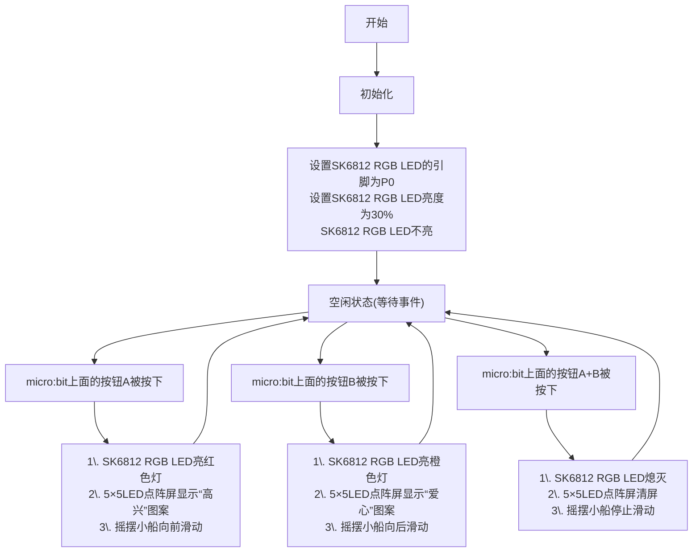

### 3.2.2 摇摆小船 

#### 3.2.2.1 简介

使用一些乐高积木件、Microbit V2主板，舵机扩展板和乐高舵机等，来搭建一个摇摆小船，通过代码编程来控制摇摆小船向前滑动、向后滑动和停止滑动。

#### 3.2.2.2 所需组件

#### 3.2.2.3 积木搭建

| 乐高舵机 | 舵机扩展板引脚(SERVO1/P1) | micro:bit主板引脚 |
| :-----: | :----------------------: | :--------------: |
|   棕线   |           GND           |         G         |
|   红线   |           VCC           |         V         |
|  橙黄线  |          SIG(S)         |         P1        |

#### 3.2.2.4 代码流程图

#### 3.2.2.5 实验代码

⚠️ **特别提醒：可以通过以下两种方法获取实验代码。**

##### **方法一：拖动代码块编写代码**

**1. MakeCode编程环境：**

打开MakeCode在线网页版本: [https://makecode.microbit.org/#editor](https://makecode.microbit.org/#editor)

**2. 添加专属扩展库**

⚠️ **特别提醒:** 将链接：`https://github.com/keyestudio2019/pxt-creative-inventors-kit-master.git` 复制粘贴到页面的搜索框中。

**3. 编写代码**

**方法二：直接下载示例代码**

##### **方法二：直接下载示例代码**

**1. 下载示例代码：**

单击下载代码：[3_3_2_Swaying_Boat](./Codes/3_3_2_Swaying_Boat.hex)

**2. MakeCode编程环境：**

打开MakeCode编辑器：[https://makecode.microbit.org/#editor](https://makecode.microbit.org/#editor)

**3. 导入示例代码：**

将下载好的示例代码拖入MakeCode编辑器。

**简单说明：**

① 初始化OLED显示屏的像素，OLED清屏。

② OLED显示屏整行显示光线亮度相关信息。

③ 这是if()...else if()...else...的判断语句。

如果检测到的光线亮度大于等于100时，Microbit主板上的5×5LED点阵屏显示""图案，同时Microbit主板上的扬声器发出警报声1。

否则如果检测到的光线亮度大于0小于100时，Microbit主板上的5×5LED点阵屏显示""图案，同时Microbit主板上的扬声器发出警报声2。

否则，Microbit主板上的5×5LED点阵屏不显示任何图案，扬声器也不发声。

④ 延时1000ms(即：1s)。

#### 3.2.2.7 实验结果

按照接线图接好线，利用micro USB数据线上电，同时还需要外接电源 (4个AAA电池安装到电池盒，且保证电源充足)。

使用在线浏览器下载示例代码，则需要将下载好的 “.hex” 文件发送到micro:bit主板。

**① 下载示例代码(WebUSB功能)**

使用 **Google Chrome** 浏览器 或  **Microsoft Edge** 浏览器，将示例代码下载到micro:bit主板上：

**② 下载示例代码(非WebUSB功能)**

使用其他浏览器（非Google Chrome 或 Microsoft Edge），将示例代码下载、发送到micro:bit主板上：

将示例代码成功下载、发送到micro:bit主板之后，然后将micro USB数据线从micro:bit主板上拔下来。

当按下micro:bit上面的按钮A时，摇摆小船向前滑动，同时SK6812 RGB LED亮红色灯，micro:bit上面的5×5LED点阵屏显示“高兴”图案；

当按下micro:bit上面的按钮B时，摇摆小船向后滑动，同时SK6812 RGB LED亮橙色灯，micro:bit上面的5×5LED点阵屏显示“爱心”图案；

当按下micro:bit上面的按钮A+B时，摇摆小船停止滑动，同时SK6812 RGB LED熄灭，micro:bit上面的5×5LED点阵屏清屏。

