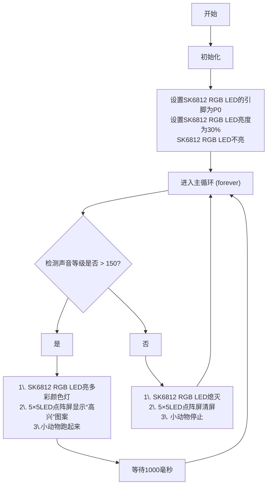

### 3.2.3 声控小动物 

#### 3.2.3.1 简介

使用一些乐高积木块、Microbit V2主板、舵机扩展板和乐高舵机等，来搭建一个小动物，通过代码编程和声音来控制小动物跑起来。

#### 3.2.3.2 元件知识

**Microbit麦克风**

micro:bit V2主板上集成了一个高质量的数字麦克风，可以用于检测声音和音频信号，位于主板的正面上方。用于控制和处理麦克风的芯片位于主板的背面。

麦克风的位置可以通过观察板子正面上方的一个小圆孔来识别。这个小孔就是麦克风的收音口，方便捕捉周围的声音信号，使用时只需将 micro:bit V2主板正面朝上放置即可。小孔旁边紧挨着麦克风LED指示灯。

当micro:bit V2主板在麦克风测量声音级别时，麦克风LED指示灯就会亮起来。

#### 3.2.3.3 所需组件

#### 3.2.3.4 积木搭建

| 乐高舵机 | 舵机扩展板引脚(SERVO2/P2) | micro:bit主板引脚 |
| :-----: | :----------------------: | :--------------: |
|   棕线   |           GND           |         G         |
|   红线   |           VCC           |         V         |
|  橙黄线  |          SIG(S)         |         P2        |

#### 3.2.3.5 代码流程图

#### 3.2.3.6 实验代码

⚠️ **特别提醒：可以通过以下两种方法获取实验代码。**

##### **方法一：拖动代码块编写代码**

**1. MakeCode编程环境：**

打开MakeCode在线网页版本: [https://makecode.microbit.org/#editor](https://makecode.microbit.org/#editor)

**2. 添加专属扩展库**

⚠️ **特别提醒:** 将链接：`https://github.com/keyestudio2019/pxt-creative-inventors-kit-master.git` 复制粘贴到页面的搜索框中。

**3. 编写代码**

##### **方法二：直接下载示例代码**

**1. 下载示例代码：**

单击下载代码：[3_3_3_Voice_Control_Animal](./Codes/3_3_3_Voice_Control_Animal.hex)

**2. MakeCode编程环境：**

打开MakeCode编辑器：[https://makecode.microbit.org/#editor](https://makecode.microbit.org/#editor)

**3. 导入示例代码：**

将下载好的示例代码拖入MakeCode编辑器。

**简单说明：**

① 初始化OLED显示屏的像素，OLED清屏。

② OLED显示屏的整行显示太阳光紫外线强度。

③ 这是if()...else...的判断语句。

当检测到的太阳光紫外线强度大于等于5时，Microbit主板上的5×5LED点阵屏显示图案 和，同时扬声器发出警报声；否则，Microbit主板上的5×5LED点阵屏显示图案，同时扬声器不发声。

④ 延时1000ms(即：1s)。

#### 3.2.3.7 实验结果

按照接线图接好线，利用micro USB数据线上电，同时还需要外接电源 (4个AAA电池安装到电池盒，且保证电源充足)。

使用在线浏览器下载示例代码，则需要将下载好的 “.hex” 文件发送到micro:bit主板。

**① 下载示例代码(WebUSB功能)**

使用 **Google Chrome** 浏览器 或  **Microsoft Edge** 浏览器，将示例代码下载到micro:bit主板上：

**② 下载示例代码(非WebUSB功能)**

使用其他浏览器（非Google Chrome 或 Microsoft Edge），将示例代码下载、发送到micro:bit主板上：

将示例代码成功下载、发送到micro:bit主板之后，然后将micro USB数据线从micro:bit主板上拔下来。

当micro:bit上面的麦克风检测到声音等级 > 150时，小动物跑起来，同时SK6812 RGB LED亮多彩颜色灯，micro:bit上面的5×5LED点阵屏显示“高兴”图案；

当micro:bit上面的麦克风检测到声音等级 < 150时，小动物停止，同时SK6812 RGB LED熄灭，micro:bit上面的5×5LED点阵屏清屏。

