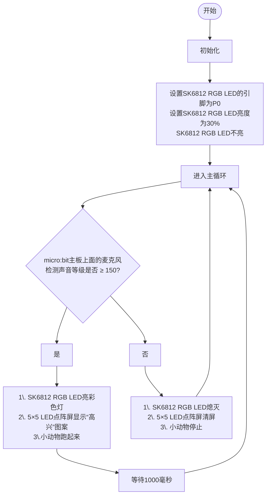

### 3.2.3 声控动物 

#### 3.2.3.1 简介

使用一些乐高积木块、Microbit V2主板、舵机扩展板和乐高舵机等，来搭建一个小动物，通过Microbit V2主板上面的麦克风和代码编程来控制动物跑起来。

#### 3.2.3.2 元件知识

**Microbit麦克风**

micro:bit V2主板上集成了一个高质量的数字麦克风，可以用于检测声音和音频信号，位于主板的正面上方。用于控制和处理麦克风的芯片位于主板的背面。

麦克风的位置可以通过观察板子正面上方的一个小圆孔来识别。这个小孔就是麦克风的收音口，方便捕捉周围的声音信号，使用时只需将 micro:bit V2主板正面朝上放置即可。小孔旁边紧挨着麦克风LED指示灯。

当micro:bit V2主板上的麦克风在测量声音级别时，麦克风LED指示灯就会亮起来。

#### 3.2.3.3 所需组件

#### 3.2.3.4 积木搭建

**电池盒中安装好4个AAA-1.5V电池（电池电源充足）**

| 乐高舵机 | 舵机扩展板引脚(SERVO2/P2) | micro:bit V2主板引脚 |
| :-----: | :----------------------: | :--------------: |
|   棕线   |           GND           |         G         |
|   红线   |           VCC           |         V         |
|  橙黄线  |          SIG(S)         |         P2        |

#### 3.2.3.5 代码流程图

#### 3.2.3.6 指令方块说明

1\. “on start”代码块中的代码将仅执行一次。

2\. “forever”代码块中的代码将循环执行.

3\. 设置micro:bit V2主板上面的5×5 LED点阵屏显示图案.

4\. 设置SK6812 RGB LED的引脚和点亮RGB LED颗粒数.

5\. 设置SK6812 RGB LED 的亮度.

6\. 设置SK6812 RGB LED 都不亮。

7\. 将SK6812 RGB LED灯设置为显示渐变色；范围：1 至 360。

8\. 这是if()...else...的判断语句。

如果if()中的条件成立时，则运行then下面的语句；否则，if()中的条件不成立，则运行else下面的语句。

9\. 设置360°舵机的引脚，转动方向(顺时针/逆时针)和转动的速度(0~100%)。

10\. micro:bit V2主板上面的5×5 LED点阵屏清屏

11\. 通过micro:bit V2主板上面的麦克风读取声音等级，范围从 0（无声）到 255（音量最大）.

12\. 这个指令方块，适用于形成判断表达式的，使用时将需要判断的两个数值或者变量模块添加到方块两端。

13\. 延时。

#### 3.2.3.7 实验代码

⚠️ **特别提醒：可以通过以下两种方法获取实验代码。**

##### **方法一：拖动代码块编写代码**

**1. MakeCode编程环境：**

打开MakeCode编辑器在线网页版本: [https://makecode.microbit.org/#editor](https://makecode.microbit.org/#editor)

**2. 添加专属扩展库**

⚠️ **特别提醒:** 将链接：`https://github.com/keyestudio2019/pxt-creative-inventors-kit-master.git` 复制粘贴到页面的搜索框中。

**3. 编写代码**

##### **方法二：直接下载示例代码**

**1. 下载示例代码：**

单击下载代码：[3_3_3_Voice_Control_Animal](./Codes/3_3_3_Voice_Control_Animal.hex)

**2. MakeCode编程环境：**

打开MakeCode编辑器在线网页版本: [https://makecode.microbit.org/#editor](https://makecode.microbit.org/#editor)

**3. 导入示例代码：**

将下载好的示例代码拖入MakeCode编辑器中。

**简单说明：**

① 初始化RGB LED的引脚P0和点亮RGB LED颗粒数，RGB LED的亮度，RGB LED全不亮。

② 在“forever”代码块中，有一个if()...else...的判断语句。

micro:bit V2主板上面的麦克风检测到声音等级 ≥ 150时，小动物跑起来1秒钟，同时SK6812 RGB LED亮彩色灯，micro:bit V2主板上面的5×5 LED点阵屏显示图案；否则，小动物停止，同时SK6812 RGB LED熄灭，micro:bit V2主板上面的5×5 LED点阵屏清屏。

#### 3.2.3.8 实验结果

按照接线图接好线，利用micro USB数据线上电，同时还需要外接电源 (4个AAA电池安装到电池盒，且保证电源充足)。

使用在线浏览器下载示例代码，则需要将下载好的 “.hex” 文件发送到micro:bit主板上。如下两种情况：

**① 下载示例代码(WebUSB功能)**

使用 **Google Chrome** 浏览器 或  **Microsoft Edge** 浏览器，需要先进行设备配对，再将示例代码下载到micro:bit V2主板上。

**② 下载示例代码(非WebUSB功能)**

使用其他浏览器（非Google Chrome 或 Microsoft Edge），将示例代码下载、发送到micro:bit V2主板上。

将示例代码成功下载、发送到micro:bit V2主板之后，然后将micro USB数据线从micro:bit V2主板上拔下来。

将舵机扩展板上的左侧拨码开关拨到RGB端，右侧拨码开关拨到ON端。

micro:bit V2主板上面的麦克风检测到声音等级 ≥ 150时，小动物跑起来1秒钟，同时SK6812 RGB LED亮彩色灯，micro:bit V2主板上面的5×5 LED点阵屏显示图案；

否则，micro:bit V2主板上面的麦克风检测到声音等级 < 150时，小动物停止，同时SK6812 RGB LED熄灭，micro:bit V2主板上面的5×5 LED点阵屏清屏。

