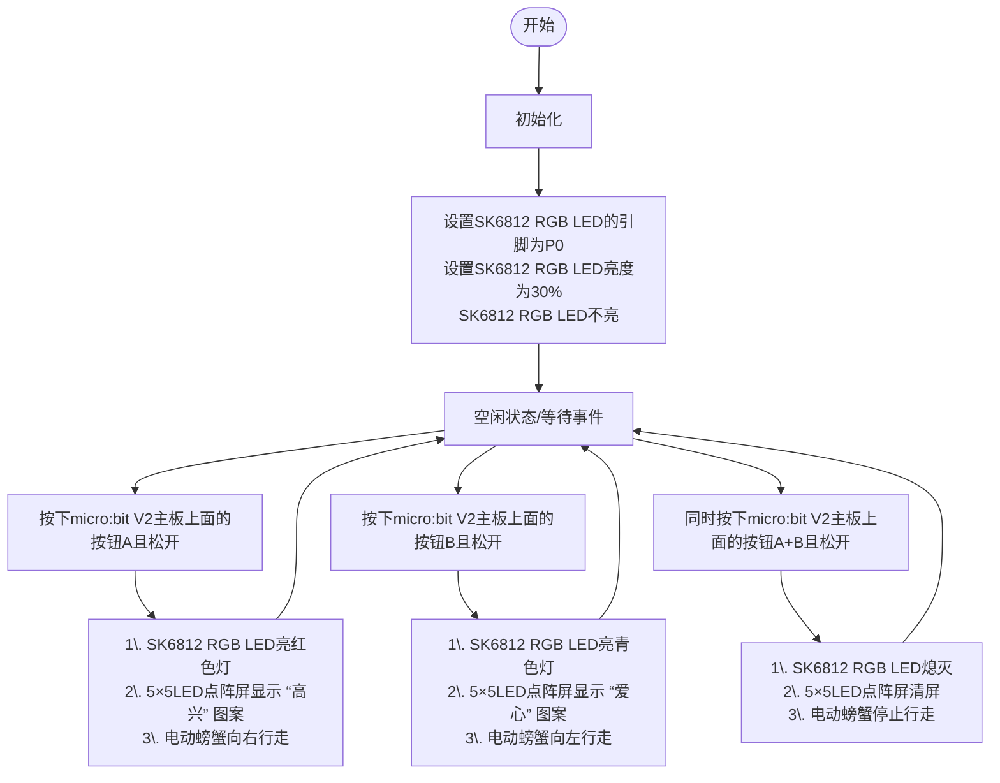

### 3.2.4 电动螃蟹 

#### 3.2.4.1 简介

使用一些乐高积木块、Microbit V2主板，舵机扩展板和乐高舵机等，来搭建一个电动螃蟹，通过Microbit V2主板上面的按钮A/B和代码编程来控制电动螃蟹向左向右爬行。

#### 3.2.4.2 所需组件

#### 3.2.4.3 积木搭建

| 乐高舵机 | 舵机扩展板引脚(SERVO1/P1) | micro:bit V2主板引脚 |
| :-----: | :----------------------: | :--------------: |
|   棕线   |           GND           |         G         |
|   红线   |           VCC           |         V         |
|  橙黄线  |          SIG(S)         |         P1        |

#### 3.2.4.4 代码流程图

#### 3.2.4.5 指令方块说明

1\. “on start”代码块中的代码将仅执行一次。

2\. 设置micro:bit V2主板上面的5×5 LED点阵屏显示图案.

3\. 设置SK6812 RGB LED的引脚和点亮RGB LED颗粒数.

4\. 设置SK6812 RGB LED 的亮度.

5\. 设置SK6812 RGB LED 都不亮。

6\. 当按下（或同时按下）按钮（A、B 或A+B）并再次松开时，触发并执行代码块中的一系列动作。

7\. 设置SK6812 RGB LED点亮的颜色灯.

8\. 设置360°舵机的引脚，转动方向(顺时针/逆时针)和转动的速度(0~100%)。

9\. micro:bit V2主板上面的5×5 LED点阵屏清屏

#### 3.2.4.6 实验代码

⚠️ **特别提醒：可以通过以下两种方法获取实验代码。**

##### **方法一：拖动代码块编写代码**

**1. MakeCode编程环境：**

打开MakeCode编辑器在线网页版本: [https://makecode.microbit.org/#editor](https://makecode.microbit.org/#editor)

**2. 添加专属扩展库**

⚠️ **特别提醒:** 将链接：`https://github.com/keyestudio2019/pxt-creative-inventors-kit-master.git` 复制粘贴到页面的搜索框中。

**3. 编写代码**

##### **方法二：直接下载示例代码**

**1. 下载示例代码：**

单击下载代码：[3_3_4_Electric_Crab](./Codes/3_3_4_Electric_Crab.hex)

**2. MakeCode编程环境：**

打开MakeCode编辑器在线网页版本: [https://makecode.microbit.org/#editor](https://makecode.microbit.org/#editor)

**3. 导入示例代码：**

将下载好的示例代码拖入MakeCode编辑器中。

**简单说明：**

① 初始化RGB LED的引脚P0和点亮RGB LED颗粒数，RGB LED的亮度，RGB LED全不亮。

② 按下micro:bit V2主板上面的按钮A且松开时，电动螃蟹向右行走，同时SK6812 RGB LED亮绿灯，micro:bit V2主板上面的5×5 LED点阵屏显示图案。

③ 按下micro:bit V2主板上面的按钮B且松开时，电动螃蟹向左行走，同时SK6812 RGB LED亮蓝灯，micro:bit V2主板上面的5×5 LED点阵屏显示图案。

④ 同时按下micro:bit V2主板上面的按钮A+B且松开时，电动螃蟹停止，同时SK6812 RGB LED熄灭，micro:bit V2主板上面的5×5 LED点阵屏清屏。

#### 3.2.4.7 实验结果

按照接线图接好线，利用micro USB数据线上电，同时还需要外接电源 (4个AAA电池安装到电池盒，且保证电源充足)。

使用在线浏览器下载示例代码，则需要将下载好的 “.hex” 文件发送到micro:bit主板上。如下两种情况：

**① 下载示例代码(WebUSB功能)**

使用 **Google Chrome** 浏览器 或  **Microsoft Edge** 浏览器，需要先进行设备配对，再将示例代码下载到micro:bit V2主板上。

**② 下载示例代码(非WebUSB功能)**

使用其他浏览器（非Google Chrome 或 Microsoft Edge），将示例代码下载、发送到micro:bit V2主板上。

将示例代码成功下载、发送到micro:bit V2主板之后，然后将micro USB数据线从micro:bit V2主板上拔下来。

将舵机扩展板上的左侧拨码开关拨到RGB端，右侧拨码开关拨到ON端。

按下micro:bit V2主板上面的按钮A且松开时，电动螃蟹向右行走，同时SK6812 RGB LED亮绿灯，micro:bit V2主板上面的5×5 LED点阵屏显示图案；

按下micro:bit V2主板上面的按钮B且松开时，电动螃蟹向左行走，同时SK6812 RGB LED亮蓝灯，micro:bit V2主板上面的5×5 LED点阵屏显示图案；

同时按下micro:bit V2主板上面的按钮A+B且松开时，电动螃蟹停止行走，同时SK6812 RGB LED熄灭，micro:bit V2主板上面的5×5 LED点阵屏清屏。

