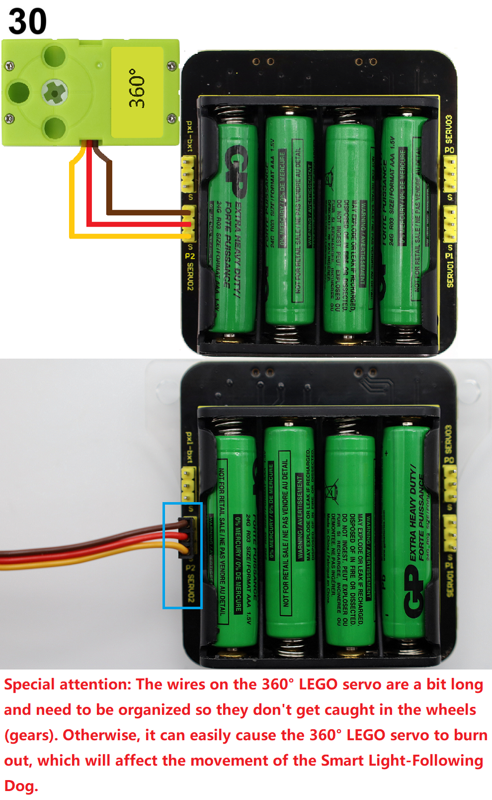
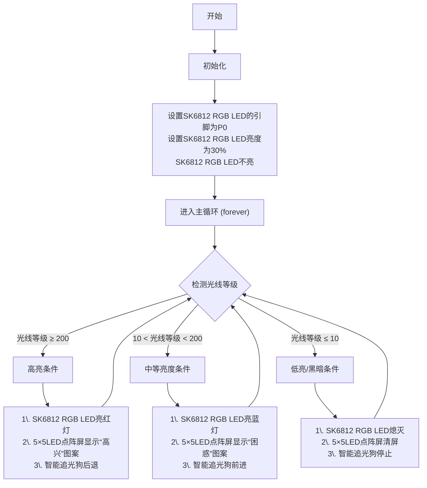
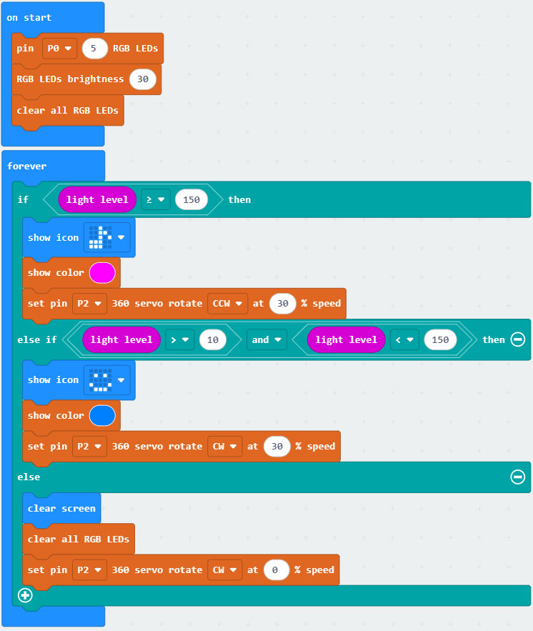

### 3.2.6 智能追光狗

#### 3.2.6.1 简介

使用一些乐高积木块、Microbit V2主板，舵机扩展板和乐高舵机等，来搭建一个智能追光狗，通过代码编程来控制智能追光狗追光运动。

#### 3.2.6.2 元件知识

**Microbit光线接收**

micro:bit主板并不自带光敏传感器，它对外界光照强度的检测是通过5×5LED点阵屏进行的，是利用5×5LED点阵屏作为光接收元件。5×5LED点阵屏被用来感知周围的光，并反复地将光照强度通过5×5LED点阵屏转换成输入，并采样电压衰减时间，这样检测出来的光照强度是一个相对值。（**注意：** 将光线亮度输出至串口，输出的是一个相对值。）

#### 3.2.6.3 所需组件

#### 3.2.6.4 积木搭建

| 乐高舵机 | 舵机扩展板引脚(SERVO2/P2) | micro:bit主板引脚 |
| :-----: | :----------------------: | :--------------: |
|   棕线   |           GND            |         G        |
|   红线   |           VCC            |         V        |
|  橙黄线  |          SIG(S)          |         P2       |

#### 3.2.6.5 代码流程图

#### 3.2.6.6 实验代码

⚠️ **特别提醒：可以通过以下两种方法获取实验代码。**

##### **方法一：拖动代码块编写代码**

**1. MakeCode编程环境：**

打开MakeCode在线网页版本: [https://makecode.microbit.org/#editor](https://makecode.microbit.org/#editor)

**2. 添加专属扩展库**

⚠️ **特别提醒:** 将链接：`https://github.com/keyestudio2019/pxt-creative-inventors-kit-master.git` 复制粘贴到页面的搜索框中。

**3. 编写代码**

##### **方法二：直接下载示例代码**

**1. 下载示例代码：**

单击下载代码：[3_3_6_Smart_Light_Following_Dog](./Codes/3_3_6_Smart_Light_Following_Dog.hex)

**2. MakeCode编程环境：**

打开MakeCode编辑器：[https://makecode.microbit.org/#editor](https://makecode.microbit.org/#editor)

**3. 导入示例代码：**

将下载好的示例代码拖入MakeCode编辑器。

**简单说明：**

① 初始化OLED显示屏的像素，OLED清屏，定义变量rain的初始值为0和Microbit主板上的5×5LED点阵屏显示图案。

② 将水滴传感器读取的雨水量强度赋给于变量rain，同时OLED显示屏的整行显示雨水量强度。

③ 这是if()...else if()...else...的判断语句。

如果检测到的雨水量强度大于15小于60%时，Microbit主板上的5×5LED点阵屏显示图案，同时Microbit主板上的扬声器发出C3低音警报声。

否则如果检测到的雨水量强度大于等于60%时，Microbit主板上的5×5LED点阵屏显示图案，同时Microbit主板上的扬声器发出B5高音警报声。

否则，Microbit主板上的5×5LED点阵屏显示图案，扬声器也不发声。

④ 延时1000ms(即：1s)。

#### 3.2.6.7 实验结果

按照接线图接好线，利用micro USB数据线上电，同时还需要外接电源 (4个AAA电池安装到电池盒，且保证电源充足)。

使用在线浏览器下载示例代码，则需要将下载好的 “.hex” 文件发送到micro:bit主板。

**① 下载示例代码(WebUSB功能)**

使用 **Google Chrome** 浏览器 或  **Microsoft Edge** 浏览器，将示例代码下载到micro:bit主板上：

**② 下载示例代码(非WebUSB功能)**

使用其他浏览器（非Google Chrome 或 Microsoft Edge），将示例代码下载、发送到micro:bit主板上：

将示例代码成功下载、发送到micro:bit主板之后，然后将micro USB数据线从micro:bit主板上拔下来。

移动光源（或者打开手机照明）照射到micro:bit上面的5×5LED点阵屏。

当光线等级 ≥ 150时，智能追光狗随光源后退，同时SK6812 RGB LED亮红灯，micro:bit上面的5×5LED点阵屏显示图案；

当 10 < 光线等级 < 150时，智能追光狗随光源前进，同时SK6812 RGB LED亮蓝灯，micro:bit上面的5×5LED点阵屏显示图案；

当光线等级 ≥ 10时，智能追光狗停止，同时SK6812 RGB LED熄灭，micro:bit上面的5×5LED点阵屏清屏。

   

