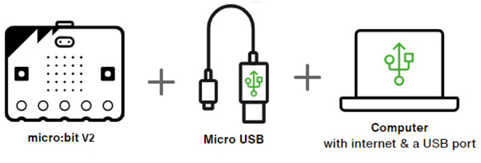
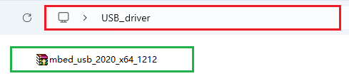
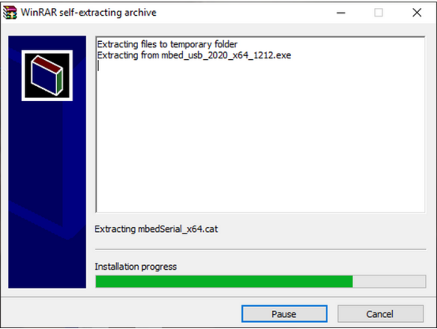
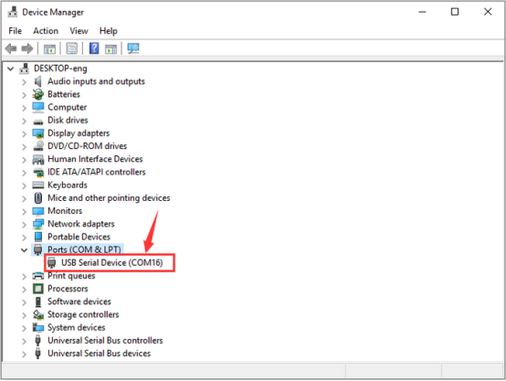

# 2. USB Driver (optional)

*This section is not mandatory to read. Sometimes the micro:bit V2 board cannot be recognized by the computer. So you may need this part.*

## 2.1 USB Driver Download

Click to download the USB driver: <u>[USB driver](./USB_driver.7z)</u>

## 2.2 Driver Installation

⚠️ Here we demonstrate how to install the driver on Windows. MacOS users may take as a reference.

1\. Connect the micro:bit V2 board to the computer via micro USB cable.

2\. In **USB driver** folder, find and open the driver file, and click on "**Install**".

3\. "**Install**" and "**Next**".

4\. "**Install**" and "**Finish**" the driver.

5\. After installation, enter "**Computer**" —> "**Properties**" —> "**Device manager**", and you can see: 

