# 1. 产品介绍

## 1.1 产品安全 

1\. 本产品含细小零件，请避免儿童独自接触。

2\. 请严格按照教程操作，避免产品损坏，注意用电安全。

---------------

## 1.2 产品简介

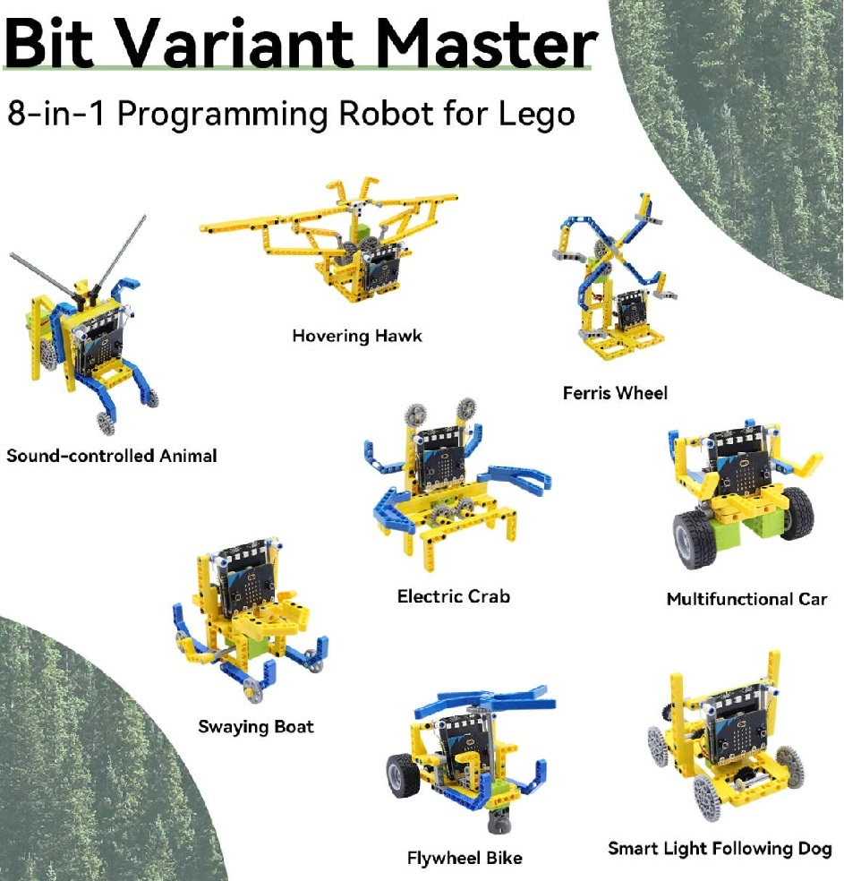

**一盒八变 · 玩出未来​**

Keyestudio Micro:bit 变形大师 8合1 编程机器人，可兼容乐高，让孩子在拼搭与编程中，收获逻辑思维、动手能力与创造力！

**特点：**

🎯 ​一盒八变，创意无限​：可搭建车辆、动物、机械等8种不同造型，持续激发孩子的创作兴趣与探索欲望。

🎯 ​乐高兼容，自由拓展​：标准乐高接口，可与家中乐高积木结合，打造独一无二的创意作品。

🎯 ​图形化编程，轻松上手​：支持MakeCode拖拽式编程，零基础也能快速入门，培养逻辑思维与动手能力。

🎯 ​声光互动，趣味十足​：Micro:bit V2主板内置声音、光线、触摸(徽标)等传感器，搭配SK6812 RGB彩灯与5×5 LED点阵屏，实现丰富的声光效果。

🎯 ​家庭与课堂皆宜​：既是亲子互动的编程玩具，也是学校与培训机构的理想STEAM教学工具

**细节区：**

🎯 ​主板​：Micro:bit V2，支持多种内置传感器与灯光互动

🎯 扩展板​：舵机控制，轻松驱动多种机械结构

🎯 ​舵机​：2×360°乐高舵机，动力稳定

🎯 ​积木​：200+ 乐高兼容零件，拼搭自由度极高

🎯 ​编程软件​：MakeCode图形化编程，支持Windows/Mac/平板

**适用人群​：**

🎯 6岁以上儿童 & 青少年

🎯 想培养孩子逻辑思维与动手能力的家长

🎯 学校、培训机构STEAM课程教师

**优点：**

🎯 ​寓教于乐​：在玩乐中掌握编程与机械知识

🎯 ​持续挑战​：8种造型+自由拓展，保持孩子兴趣

🎯 ​安全材质​：环保ABS塑料，守护孩子健康

🎯 ​专业支持​：提供详细教程与案例，轻松上手

---------------

## 1.3 产品清单

如果发现有缺失的配件，请立即联系我们的销售人员。

| 序号 | 规格 | 数量| 图片 |
| :--: | :--: | :--: | :--: |
| 1 |Microbit V2主板+舵机扩展板  | 1 | 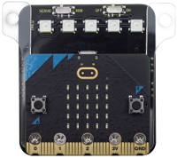 |
| 2 | 360°乐高舵机 | 2 | 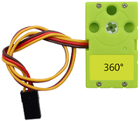 |
| 3 | 积木拆卸钳子 | 1 | 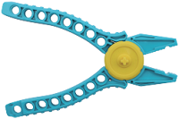 |
| 4 | 32009 乐高件 | 6 | |
| 5 | 64179 乐高件 | 5 |  |
| 6 | 32278 乐高件 | 5 | 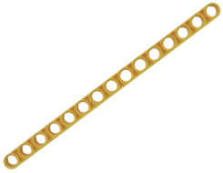 |
| 7 | 41239 乐高件 | 4 | 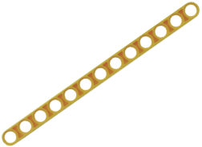 |
| 8 | 32525 乐高件 | 4 | 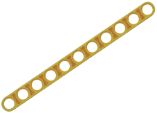 |
| 9 | 40490 乐高件 | 4 | 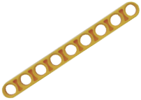 |
| 10 | 32524 乐高件 | 3 | 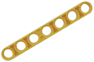 |
| 11 | 32316 乐高件 | 5 |  |
| 12 | 32523 乐高件 | 4 |  |
| 13 | 32526 乐高件 | 12 |  |
| 14 | 32348 乐高件 | 2 |  |
| 15 | 60484 乐高件 | 2 | 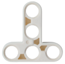 |
| 16 | 14720 乐高件 | 5 |  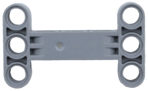 |
| 17 | 3649 乐高件 | 4 |  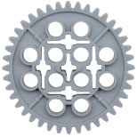 |
| 18 | 3648 乐高件 | 6 | 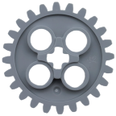 |
| 19 | 4185 乐高件 | 4 | 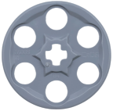 |
| 20 | 32269 乐高件 | 3 |  |
| 21 | 3647 乐高件 | 2 | 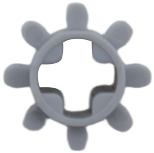 |
| 22 | 4716 乐高件 | 2 | 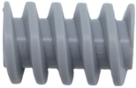 |
| 23 | 6589 乐高件 | 2 | 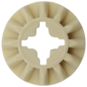 |
| 24 | 55615 乐高件 | 2 | 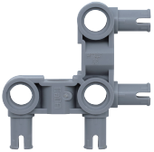 |
| 25 | 48989 乐高件 | 2 | 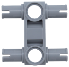 |
| 26 | 3708 乐高件 | 2 | 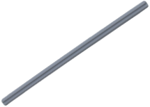 |
| 27 | 3707 乐高件 | 1 | 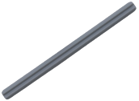 |
| 28 | 44294 乐高件 | 2 | 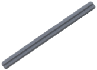 |
| 29 | 32073 乐高件 | 2 | 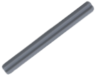 |
| 30 | 3705 乐高件 | 2 | 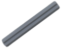 |
| 31 | 4519 乐高件 | 2 | 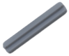 |
| 32 | 32062 乐高件 | 4 |  |
| 33 | 车轮 | 2 | 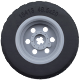|
| 34 | 32034 乐高件 | 2 | 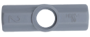 |
| 35 | 32039 乐高件 | 4 |  |
| 36 | 32192 乐高件 | 2 | 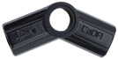 |
| 37 | 32184 乐高件 | 2 |   |
| 38 | 15100 乐高件 | 4 |  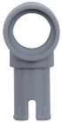 |
| 39 | 3713 乐高件 | 6 | 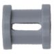 |
| 40 | 18654 乐高件 | 2 | 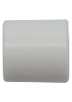 |
| 41 | 4265c 乐高件 | 6 |  |
| 42 | 2780 乐高件 | 50 | 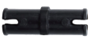 |
| 43 | 6558 乐高件 | 13 |  |
| 44 | 3749 乐高件 | 12 | 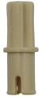 |
| 45 | 3673 乐高件 | 13 |  |
| 46 | 32002 乐高件 | 5 | 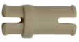 |
| 47 | 万向轮 | 1 | 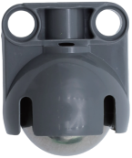 |
| 48 | micro USB数据线 | 1 | 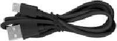 |
| 49 | AAA-1.5V电池 (不提供，自备) |4| 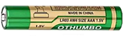 |

---------------

## 1.4 产品参数

- 工作电压：DC 3.3V ~ 6V

- 电池电压：DC 6V

- 最大输出电流：约600mA（受电池内阻和负载影响，峰值随电池品牌/条件而变化）

- 最大耗散功率：约3.6W（6V × 600mA，实际取决于负载）

- 工作温度：-25℃ ~ 65℃

- 产品重量：277.4g±1%（增加包装后的重量）

- 包装尺寸：230mm×105mm×50mm(±1%)

---------------

## 1.5 Micro:bit快速掌握

### 1.5.1 Micro:bit是什么？

micro:bit V2主板拥有丰富的板资源，搭载了5×5可编程LED点阵、2颗可编程按键、加速度计、电子罗盘、温度计、可触摸感应的Logo、MEMS麦克风、低功耗蓝牙等电子模块，背面还有一个蜂鸣器，可以在没有外部设备的情况下也可以播放各种声音。此外，micro:bit V2主板还支持休眠模式，用户可以长按micro:bit V2主板后面的复位&电源按钮，使进入睡眠模式，降低电池功耗。

### 1.5.2 Micro:bit V2主板硬件介绍

### 1.5.3 Micro:bit V2主板引脚配置介绍

Micro:bit V2主板引出的引脚中，其引脚功能分类如下表所示：

| 功能 | 引脚 |
| :--: | :--: | 
| GPIO | P0，P1，P2，P3，P4，P5，P6，P7，P8，P9，P10，P11，P12，P13，P14，P15，P16，P19，P20 |
| ADC/DAC | P0，P1，P2，P3，P4，P10 |
| IIC | P19（SCL），P20（SDA）|
| SPI | P13（SCK），P14（MISO），P15（MOSI） |
| PWM（常用） |P0，P1，P2，P3，P4，P10|
|已占用|P5(Button A)，P6(LED Col4)，P7(LED Col2)，P10(LED Col5)，P11(Button B)|

详细信息请参考官方网站：

- [https://tech.microbit.org/hardware/edgeconnector/](https://tech.microbit.org/hardware/edgeconnector/)

- [https://microbit.org/code/](https://microbit.org/code/)

- [https://microbit.org/get-started/features/overview/](https://microbit.org/get-started/features/overview/)

- [https://microbit.org/guide/hardware/pins/](https://microbit.org/guide/hardware/pins/)

- [https://microbit.org/projects/make-it-code-it/](https://microbit.org/projects/make-it-code-it/)

- [https://microbit.org/get-started/what-is-the-microbit/](https://microbit.org/get-started/what-is-the-microbit/)

关于编程环境，BBC提供了一个在线编程网站: [https://makecode.microbit.org](https://makecode.microbit.org)，里面有一个易于使用的图形化编程程序MakeCode。

---------------

## 1.6 舵机扩展板介绍

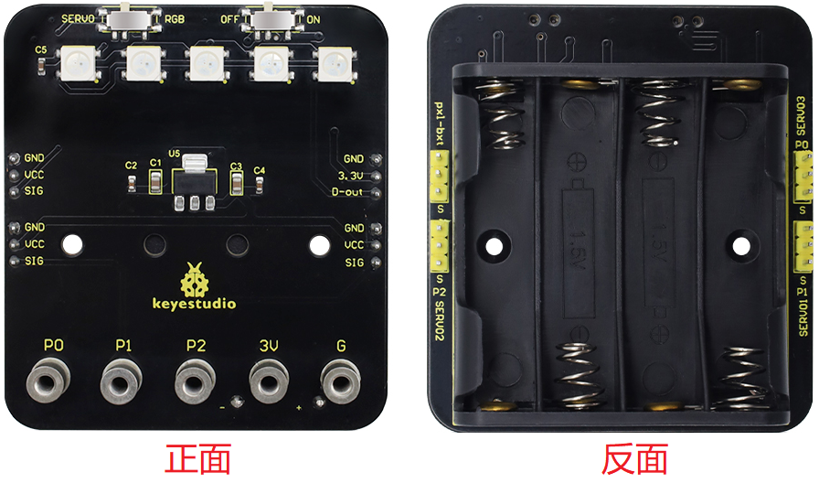

### 1.6.1 简介

舵机扩展板是一款与Micro:bit V2主板完全兼容的扩展板。它具有板载4节AAA电池座，板载5个SK6812 RGB灯，并提供4组标准3-pin外设接口，间距为2.54mm，支持RGB LED灯带扩展或控制3个舵机。

**拨码开关功能：**

- 右边的电源拨码开关：当开关拨到ON端时，电源通过电池盒供电；当切换到OFF端时，电源被切断。

- 左边的功能拨码开关：

   - 开关拨到RGB：micro:bit V2主板可以通过代码程序来控制5个板载SK6812 RGB灯的颜色，并且pxl-bxt上的3pin接口也可以连接SK6812 RGB灯带并控制其颜色。
   
   - 开关拨到SERVO：micro:bit V2主板可以通过代码程序来调节连接到SERVO3的3pin接口的外部舵机的角度。

**注意：** SK6812 RGB LED模式和SERVO模式是多路复用的，请根据您的应用程序切换到相应的模式。

### 1.6.2 参数

- 工作电压：3.3-6V（建议板载电源：4×AAA电池(1.5V)，标称总电压约6V）
 
- 待机电流：约60mA（不包括外设）

- 最大输出电流：约600mA（受电池内阻和负载影响，峰值随电池品牌/条件而异）

- 最大功率：约3.6 W （6V × 600mA，实际取决于负载）

- 工作温度：-25℃~ 65℃

- 尺寸：64mm × 58mm × 21mm

- 重量：约28.1克(包括电池座，电池和Micro:bit V2主板不包括在内)

- 环境性：ROHS

- 接口和资源：

   - 板载SK6812 RGB灯×5（可编程全彩）
   
   - 3-pin舵机接口×3（SERVO1/SERVO2/SERVO3，标准GND/5V/SIG 3-pin）
   
   - 通用3-pin 2.54mm 接口×4（GND/VCC/SIG，GND/3.3V/D-out）
   
   - 外接SK6812 RGB灯带接口×1（GND/3.3V/D-out）

- 安装4个新的AAA-1.5V 电池，注意正确的极性。

- 连接外部设备:

    - RGB扩展：将可编程SK6812 RGB LED模块连接到3Pin接口(注意DIN方向)。

    - 舵机扩展：将舵机信号线连接到SERVO1/2/3(棕色/黑色 = GND，红色 = V+，橙色/黄色 = SIG)。

- 拨码开关设置:

    - 将右侧拨码开关切换到ON端以实现电源供电。

    - 根据您的应用模式将左侧拨码开关切换到RGB或SERVO。

---------------

